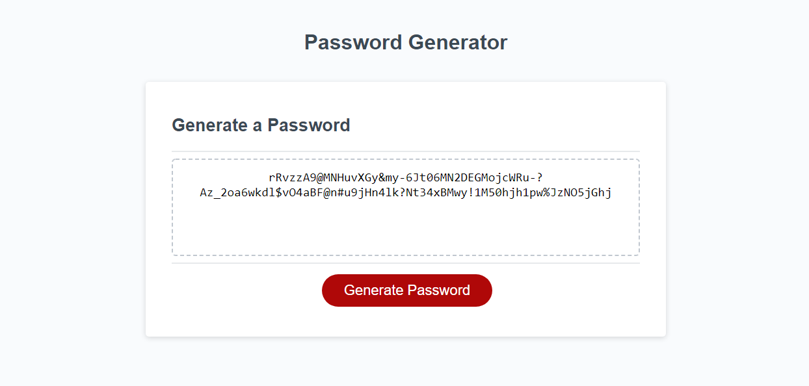

## Password generator

Application randomly generates a password for the user that meets the user's criteria.

## Description

When the user clicks the 'Generate Password' button, the user is presented with a series of prompts.

First the user is prompted to enter the length of the desired password. The password must be between 8 and 128 characters. If the user enters a number outside of those parameters, the user is prompted to enter a corrected number. If the user enters a non-number, the user is then prompted to enter a number again until a valid number is entered.

The user is then asked to confirm if they would like to include special characters, lowercase letters, uppercase letters and/or numbers.

As long as the user confirms one of the above characters, a password will be generated using the desired characters at the desired length.

If the user does not choose to include any of the above characters, the application will instead display 'No criteria selected. Try again.'

The user can then copy the generated password inside the dotted box.

## Screenshot of generated password

## Live Link
https://jessicamcg.github.io/password-generator/